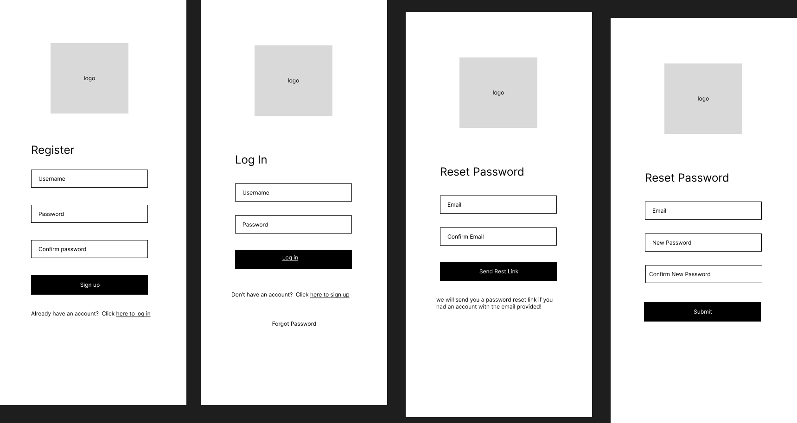
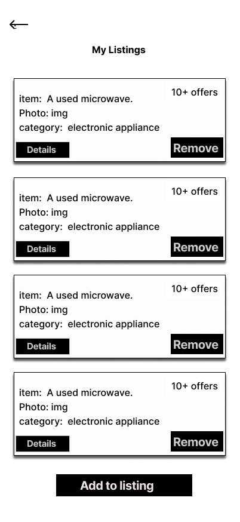

# User Experience Design

## Prototype

The **SwapBay interactive prototype** provides a visual representation of the application's core user flows and layout.  
It illustrates how users will navigate between pages. This prototype serves as the foundation for front-end design decisions.

You can explore the prototype here:  
[View the SwapBay Figma Prototype](https://www.figma.com/proto/MEFf9AH5Hf5Vi8sPdC7UUp/swapbay-wireframe?node-id=5-34&p=f&t=UuftW7pridzlyPbC-1&scaling=scale-down&content-scaling=fixed&page-id=5%3A33&starting-point-node-id=5%3A34)

---

## App Map

### Navigation Flow Diagram

---
### Onboarding Phase

*Purpose:* Entry point for existing and new users to access their account.
---
### Home Page

*Purpose:* On the Home page, Users can browser/search/filter postings, make offers, message owners, access their profile settings, inbox and status of their offers. 

---

### Add New Listing Page

**Purpose:**  
Allows sellers to create new listings by entering details about the item they want to sell or swap.

**Key Features:**
- Input fields for *Item Name*, *Category*, *Description*, and *Condition*.  
- Placeholder gray box for uploading an image.  

- **Proceed** button at the bottom to finalize the post.  

---

### My Listings Page

**Purpose:**  
Displays all items the user has listed for sale or swap.

**Key Features:**
- Card layout showing each listing with name, image placeholder, and brief details.  
- Indicators showing *number of offers* received for each item.  
- Action buttons for **Details**, or **Remove** a listing.  
- **Add Listing** shortcut button for convenience.  

---

### Per Listing Details Page

**Purpose:**  
Shows complete details about a single listing, including received offers and offer status.

**Key Features:**
- Gray placeholder box for the item image.  
- Text fields displaying the *item description*, *condition*, and *category*.  
- Section for *offers received* 

---

### Offer Composer Screen

**Purpose:**  
Allows the user to compose an offer for another item.

**Key Features:**
- Displays the target item summary (title, category, and offer count).  
- Options to either **Add Money** or **Swap Item** with respective input fields.  
- Input areas for amount, item name, and item description.  
- “Upload Photo” button for file upload.  
- **Confirm Offer** button to submit.
---

### Profile and Edit Screen
 

**Purpose:**  
Displays user account details and available actions.

**Key Features:**
- Placeholder for profile picture.  
- Text areas for **Name**, **Email Address**, and **Phone Number**.  
- Buttons for **Edit Profile**, **Delete Account**, and **Log Out**.  
- Change photo option.  
- Editable fields for name, phone number, and email address.  
- **Done Editing** button confirms changes.  
- **Cancel Edit** button returns to the previous screen.

---

### My Offers Page

**Purpose:**  
Allows users to view all the offers they have made to other users' listings.

**Key Features:**
- Organized card layout showing each offer with details such as *item name*, *offer type* (money or swap), and *offer status* (pending, accepted, or rejected).  
- Quick navigation to each item's details to track progress or withdraw offers.  
- Clear indicators for pending and completed transactions to keep users informed.  
- Visual consistency with other listing pages for a seamless experience.

---

### Inbox Page

**Purpose:**  
Provides a central communication hub where users can manage all their chats.

**Key Features:**
- List view showing all chat partners with *profile image*, *name*, and *last message preview*.  
- Navigation options to go **back to Home**, **open Profile**, or **view Chat History**.  
- Notification indicators for unread messages to keep users updated.  
- Intuitive design enabling users to quickly jump between ongoing conversations.

---

### Chat View Page

**Purpose:**  
Facilitates one-on-one conversations between users to negotiate or discuss offers.

**Key Features:**
- Clear distinction between **sent** and **received** messages for readability.  
- Option to return to **Inbox** or **Profile** for navigation consistency.  
- Chat bubbles designed to resemble common messaging interfaces for familiarity.  
- Space for inputting and sending new messages at the bottom of the screen.  
- Potential integration of multimedia (e.g., image sharing) in later iterations.

---

